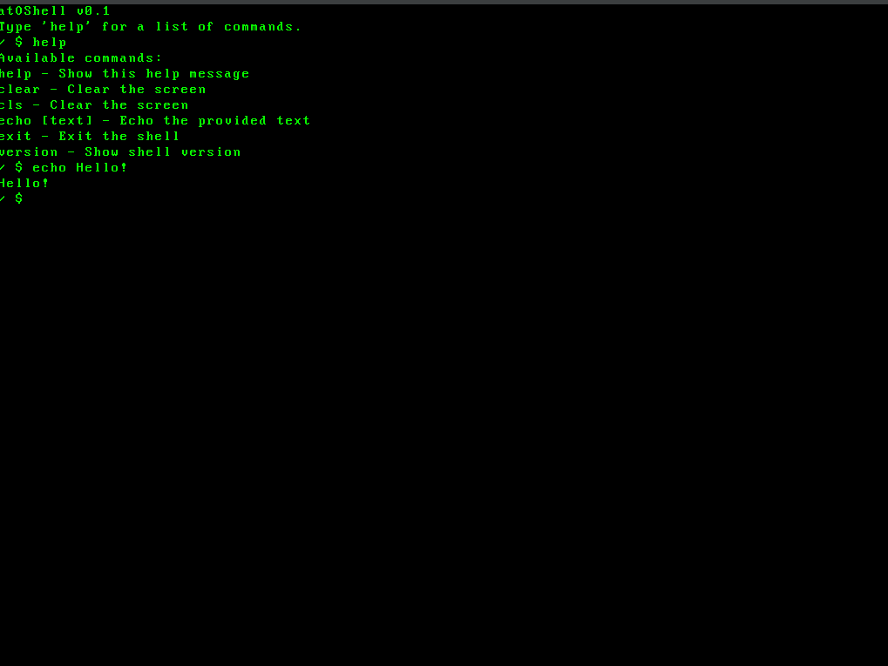
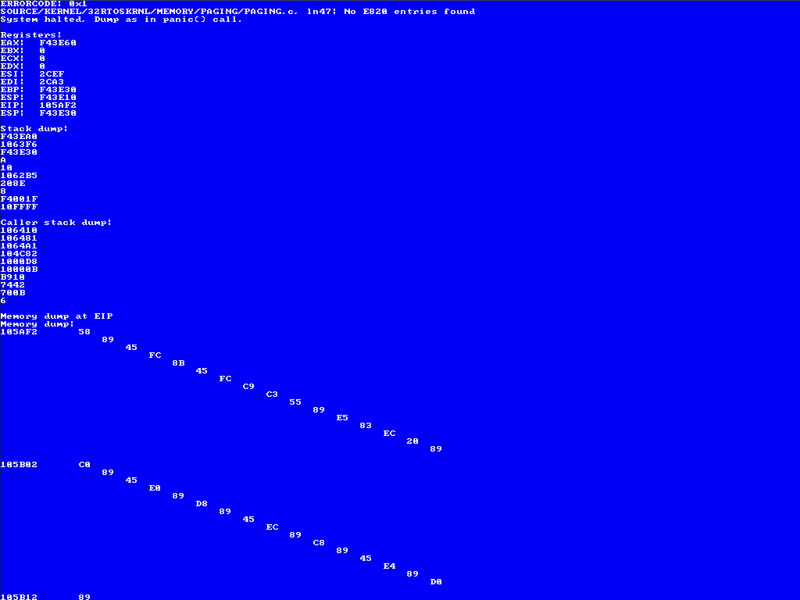

# atOS — a 32-bit Operating System


⚠️ **atOS is in early development**  

A custom 32-bit operating system written in **C** and **Assembly**.  
Boots from an ISO image and runs as a raw binary.  
Intentionally built without modern security constraints to encourage deep low-level learning, experimentation, and hacking.

---

## Preview




---

## Table of Contents

- [Overview](#overview)
- [Features](#features)
- [Running atOS](#running-atos)
- [Development](#development)
  - [Dependencies](#dependencies)
  - [Building](#building)
  - [Debugging](#debugging)
- [Project Roadmap](#project-roadmap)
- [Documentation](#documentation)
- [License](#license)

---

## Overview

atOS is a **from-scratch 32-bit x86 operating system** crafted in C and Assembly.
The project is geared toward systems programmers, students, and OS enthusiasts who want to explore how operating systems work at the hardware/software boundary.

Unlike modern operating systems, atOS removes safety restrictions, giving developers complete control and transparency into memory, hardware, and execution.

This makes atOS ideal for learning, experimentation, and low-level programming without the abstractions and protections of contemporary OSes.

**TL;DR**: atOS is a simple, open-source 32-bit Ring0 operating system designed for educational purposes and low-level exploration.

---

## Features

- 🖥️ **32-bit x86 Architecture** — runs on legacy and virtualized hardware (Not tested).
- 🛠️ **Custom Language Support** — an integrated experimental language for writing applications.
- 🔓 **No Safety Barriers** — Ring0, no protection layers or user/kernel enforcement, making it ideal for exploration and teaching.
- 📖 **Open Source** — licensed under MIT, free to use, modify, and extend.
- 🐧 **Educational Focus** — designed as a learning tool for understanding OS concepts, not for production use.
- 🧩 **Modular Design** — components like memory management, file systems, and drivers are separated for easier study and modification.
- 🖥️ **Graphical Output** — basic VBE graphics support for simple GUIs and visual applications.
- 🗄️ **File System Support** — ISO9660 for CD-ROM images, FAT32 for hard drives.
- 🖱️ **Input Handling** — keyboard and mouse drivers for user interaction.
- 🐢 **Multitasking** — cooperative multitasking with a simple scheduler.
- 🐚 **Shell Environment** — a basic command-line shell for interacting with the OS

---

## Running atOS

You can run atOS from the provided ISO in a virtual machine.  
QEMU is the recommended environment, others aren't guaranteed to work.

### System Requirements

| Resource | Recommended | Minimum |
| -------- | ----------- | ------- |
| RAM      | 1024 MB     | 550 MB   |
| CPU      | 1 Core      | 1 Core  |
| HDD      | 256 MB      | 128 MB  |

### Install QEMU (Debian/Ubuntu)

```bash
sudo apt install qemu-system-x86
````

### Install QEMU (Windows)

Download from the [official QEMU website](https://www.qemu.org/download/#windows) and follow the installation instructions, or use [WSL](https://learn.microsoft.com/en-us/windows/wsl/install) with the Linux instructions above.

### Booting atOS with QEMU

```bash
  # If you want to use ethernet driver, run these
  sudo ip tuntap add dev tap0 mode tap;
  sudo ip link set tap0 up;

  # Creates a hard disk image.
	qemu-img create -f raw hdd.img 256M   

  # Runs Qemu from ISO with attached HDD, RTL8139, AC97 and PCI support
	qemu-system-i386 -vga std \
	-m 1024 \
	-boot order=d \
	-cdrom $(OUTPUT_ISO_DIR)/$(ISO_NAME) \
	-drive id=cdrom,file=$(OUTPUT_ISO_DIR)/$(ISO_NAME),format=raw,if=none \
	-drive id=hd0,file=hdd.img,format=raw,if=none \
	-device piix3-ide,id=ide \
	-device ide-hd,drive=hd0,bus=ide.0 \
	-device ide-cd,drive=cdrom,bus=ide.1 \
	-device ac97,audiodev=snd0 \
	-netdev tap,id=tap0,ifname=tap0,script=no,downscript=no \
	-device rtl8139,netdev=tap0,mac=52:54:00:12:34:56 \
	-audiodev sdl,id=snd0
```

---

## Development

Want to dig into the source or contribute? Here’s how to set up the environment.

### Dependencies

Install the essential build tools:

```bash
sudo apt install qemu-system-x86 nasm make gcc genisoimage cmake ninja-build
```

### Building

The project uses `make` with simple targets:

* **Show all available commands:**

  ```bash
  make help
  ```

* **Build and launch atOS:**

  ```bash
  make iso run
  ```

* **Build and launch atOS with ethernet driver:**

  ```bash
  sudo make iso runn
  ```

### Debugging

Debugging support is minimal.
Please see `DOCS/DEBUGGING.md` for options and tips. When using `make run`/`make run_user_gui`, QEMU writes a debug log to:

- `OUTPUT/DEBUG/debug.log` (port 0xE9 debugcon)

---

## Project Roadmap

Planned and in-progress features for atOS:

* [x] Bootloader and raw binary kernel loading
* [x] Basic memory management (paging, allocator, frame BYTEMAP)
* [X] ISO9660 support
* [X] Basic drivers (keyboard, screen, disk I/O)
* [X] Ethernet driver
* [ ] FAT32 filesystem support
* [X] System call interface
* [X] Multitasking and scheduling
* [X] Shell environment for interacting with the system
* [ ] Userland application support via custom language

*This roadmap is tentative and may evolve as the project grows.*

---

## Documentation

Additional documentation is located in the `DOCS/` folder, as well as inline within source directories and headers.

---

## License

This project is licensed under the **MIT License**.
See the [LICENSE](LICENSE) file for details.

## Credits

- [CREDITS](CREDITS) file for a full list of credits and acknowledgments.
 
---
